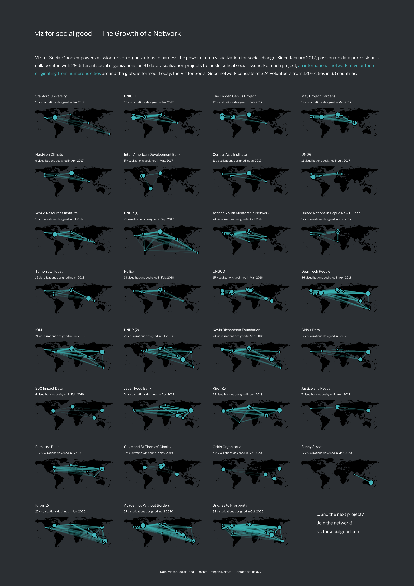

# Viz for Social Good project on Viz for Social Good

[Viz for Social Good](https://www.vizforsocialgood.com/) helps mission-driven organizations to promote social good and understand their own data through beautiful and informative data visualization; visualizations made by volunteers, like me.  

For this project, Viz for Social Good is looking to visualize its own data.  

The end goal is to:
1) inspire more data professionals to join the initiative by seeing the impact they will be able to make through creating visualizations.
2) to showcase to charities how data can help them achieve their mission much more effectively.

## My Submissions

I decided to highlight the global network of volunteers on a map. The network of the cities from every volunteer who participated in a project is drawn on a map, and the cities (nodes) are linked to highlight the network formed for the project. I designed three visualizations, which are similar, but which address different audiences. They all show the same data, it is just the framing of the title, description and call to action that vary.      

The first visualization is for (future) volunteers. Participating in a project is joining an international network of volunteers from numerous cities around the globe.

The second is for (future) partners. Collaborating with Viz for Social Good for a project is benefitting from an international network of volunteers from numerous cities around the globe!

The third, showing the networks formed for all the projects so far, is for the Viz for Social Good nerds:

You can download all the visualizations in PDF, PNG, or SVG format [there](https://github.com/de-la-viz/vsfg_2020/tree/main/viz). Clone the repo and run [draw_networks.R](https://github.com/de-la-viz/vsfg_2020/blob/main/draw_networks.R) to reproduce the plots.  

## Design Choices

The intent is both to show the extent of the network of data professionals working together on a project, and the international, global, nature of the formed networks. Thus, the choice of showing the networks on a map. The maps are dark and only suggested, to let the network come first. 

The blue (or green?) used is the one used on Viz for Social Good website, _#51C2C8_. The same for the font, _Libre Franklin_. There is a lighter version of the visualization, too, but the visualizations are more striking with the dark background.   

Initially, I built the full visualization (A4 format) with all the projects. However, it is quite explorative, crowded, and does not necessarily convey the message so well. So, in a second step, I built the two smaller ones. The smaller selection of projects (the 7 with the most submissions), as well as the modified descriptions and titles, are better in telling the story, in my opinion, and thus at inspiring new volunteers to participate or new charities to launch a project.   
